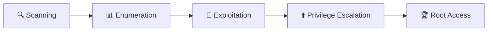

# 🔐 Boot2Root - BornToSec

<div align="center">


*A comprehensive penetration testing and privilege escalation challenge from 42 School*

</div>

---

## 📖 About

**Boot2Root** is an information security project from the 42 curriculum where the objective is to gain **root access** on a deliberately vulnerable virtual machine. This project simulates real-world penetration testing scenarios, requiring a methodical approach to identify and exploit vulnerabilities.

### 🎯 Objective

Starting with a vulnerable ISO image, find multiple pathways to compromise the system and escalate privileges to root, documenting each attack vector in detailed writeups.

---

## 🛠️ Skills Developed

| Category | Skills |
|----------|--------|
| **Reconnaissance** | Network scanning, service enumeration, fingerprinting |
| **Exploitation** | Web app vulnerabilities, service exploitation, reverse engineering |
| **Privilege Escalation** | Kernel exploits, misconfigurations, SUID/GUID abuse |
| **Post-Exploitation** | Persistence, lateral movement, data exfiltration |

---

## 🗂️ Repository Structure

```
BornToSec/
├── 📄 Boot2root.pdf       # Project subject and requirements
├── 📝 writeup1            # First exploitation path
├── 📝 writeup2            # Alternative exploitation path
├── 📁 bonus/              # Additional challenges
├── 📁 scripts/            # Automation and helper scripts
└── 📄 LICENSE
```

---

## 🚀 Getting Started

### Prerequisites

- **VirtualBox** or **VMware** for running the vulnerable ISO
- **Kali Linux** or similar penetration testing distribution
- Network analysis tools: `nmap`, `netdiscover`, `dirb`
- Exploitation frameworks: `Metasploit`, `Burp Suite`

### Setup

1. Download and import the Boot2Root ISO into your hypervisor
2. Configure network settings (NAT or Host-Only)
3. Boot the vulnerable machine and note its IP address
4. Begin reconnaissance from your attack machine

---

## 📋 Methodology



1. **Scanning** - Identify live hosts and open ports
2. **Enumeration** - Discover services, versions, and potential entry points  
3. **Exploitation** - Gain initial foothold on the system
4. **Privilege Escalation** - Escalate from user to root
5. **Documentation** - Record findings in detailed writeups

---

## 📝 Writeups

| Path | Description | Difficulty |
|------|-------------|------------|
| [Writeup 1](./writeup1) | Primary exploitation vector | ⭐⭐⭐ |
| [Writeup 2](./writeup2) | Alternative attack path | ⭐⭐⭐⭐ |

---

## ⚠️ Disclaimer

> [!CAUTION]
> This project is for **educational purposes only**. The techniques demonstrated should only be used on systems you own or have explicit permission to test. Unauthorized access to computer systems is illegal.

---

## 📚 Resources

- [OWASP Testing Guide](https://owasp.org/www-project-web-security-testing-guide/)
- [GTFOBins](https://gtfobins.github.io/) - Unix binaries for privilege escalation
- [PayloadsAllTheThings](https://github.com/swisskyrepo/PayloadsAllTheThings) - Useful payloads
- [HackTricks](https://book.hacktricks.xyz/) - Penetration testing methodology

---

## 👤 Author

**42 Student** - Security Enthusiast

---

## 📜 License

This project is licensed under the terms specified in the [LICENSE](./LICENSE) file.

---

<div align="center">

*"The quieter you become, the more you can hear."* - Ram Dass

**Happy Hacking! 🎭**

</div>
